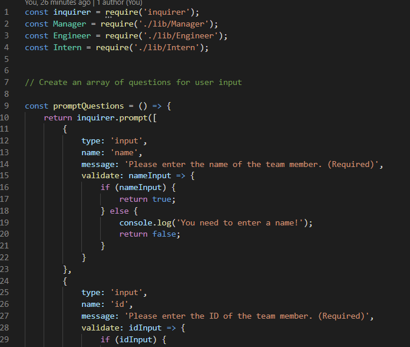

# zpl-team-profile-generator
## Description
  
  - What was my motivation? I wanted to make an application that generates profiles for a team of workers.
  - Why did I build this project? I wanted to create an application that quickly creates profiles for team members based on user input.
  - What problem does it solve? It solves the problem of needing to create profiles on a team from scratch.
  - What did I learn? I learned how to create and run tests for classes using JEST.
  - What makes my project stand out? My project has fleshed-out and easy to understand tests.
## Table of Contents
  
  - [Description](#description)
  - [Usage](#usage)
  - [License](#license)

  ## Usage

  
  
  [Demonstration Video](https://youtu.be/Cm081NZr5xM)
  ## License

  No license.
  ## User Story
  AS A manager
  I WANT to generate a webpage that displays my team's basic info
  SO THAT I have quick access to their emails and GitHub profiles

  ## Acceptance Criteria
  GIVEN a command-line application that accepts user input
  WHEN I am prompted for my team members and their information
  THEN an HTML file is generated that displays a nicely formatted team roster based on user input
  WHEN I click on an email address in the HTML
  THEN my default email program opens and populates the TO field of the email with the address
  WHEN I click on the GitHub username
  THEN that GitHub profile opens in a new tab
  WHEN I start the application
  THEN I am prompted to enter the team manager’s name, employee ID, email address, and office number
  WHEN I enter the team manager’s name, employee ID, email address, and office number
  THEN I am presented with a menu with the option to add an engineer or an intern or to finish building my team
  WHEN I select the engineer option
  THEN I am prompted to enter the engineer’s name, ID, email, and GitHub username, and I am taken back to the menu
  WHEN I select the intern option
  THEN I am prompted to enter the intern’s name, ID, email, and school, and I am taken back to the menu
  WHEN I decide to finish building my team
  THEN I exit the application, and the HTML is generated
  ---

  ## Questions?
  If you have any questions, check out my [GitHub profile](https://github.com/zachary-levin) at or email me at [zlevin706@gmail.com](mailto:zlevin706@gmail.com)

